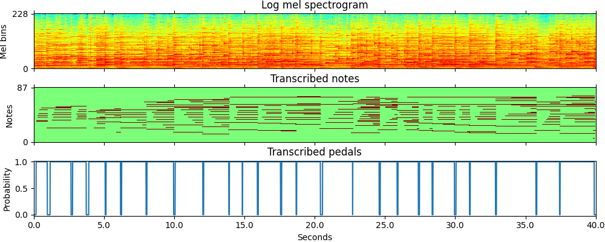
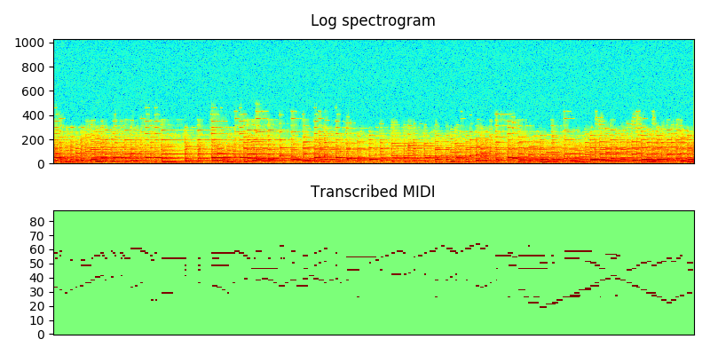

# Piano transcription

Piano transcription is the task of transcribing piano recordings into MIDI files. This repo is the PyTorch implementation of our proposed high-resolution piano transcription system [1].

<a href="https://replicate.com/replicate/piano-transcription"></a>

## Demos
Here is a demo of our piano transcription system: https://www.youtube.com/watch?v=5U-WL0QvKCg

[Demo and Docker image on Replicate](https://replicate.ai/bytedance/piano-transcription)

## Environments
This codebase is developed with Python 3.7 and PyTorch 1.4.0 (Should work with other versions, but not fully tested).

Install dependencies:
```
pip install -r requirements.txt
```

## Piano transcription using pretrained model
The easiest way is to transcribe a new piano recording is to install the piano_transcription_inference package: https://github.com/qiuqiangkong/piano_transcription_inference with pip as follows: 

```
pip install piano_transcription_inference
```

Then, execute the following commands to transcribe this [audio](resources/cut_liszt.mp3).

```
from piano_transcription_inference import PianoTranscription, sample_rate, load_audio

# Load audio
(audio, _) = load_audio('resources/cut_liszt.mp3', sr=sample_rate, mono=True)

# Transcriptor
transcriptor = PianoTranscription(device='cuda')    # 'cuda' | 'cpu'

# Transcribe and write out to MIDI file
transcribed_dict = transcriptor.transcribe(audio, 'cut_liszt.mid')
```

## Train a piano transcription system from scratch

This section provides instructions if users would like to train a piano transcription system from scratch.

### 0. Prepare data
We use MAESTRO dataset V2.0.0 [1] to train the piano transcription system. MAESTRO consists of over 200 hours of virtuosic piano performances captured with fine alignment (~3 ms) between note labels and audio waveforms. MAESTRO dataset can be downloaded from https://magenta.tensorflow.org/datasets/maestro.

Statistics of MAESTRO V2.0.0 [[ref]](https://magenta.tensorflow.org/datasets/maestro#v200):

| Split      | Performances | Duration (hours) | Size (GB) | Notes (millions) |
|------------|--------------|------------------|-----------|------------------|
| Train      |          967 |            161.3 |      97.7 |             5.73 |
| Validation |          137 |             19.4 |      11.8 |             0.64 |
| Test       |          178 |             20.5 |      12.4 |             0.76 |
| **Total**  |      **1282**|         **201.2**|  **121.8**|          **7.13**|

After downloading, the dataset looks like:

<pre>
dataset_root
├── 2004
│    └── (264 files)
├── 2006
│    └── (230 files)
├── 2008
│    └── (294 files)
├── 2009
│    └── (250 files) 
├── 2011
│    └── (326 files)
├── 2013
│    └── (254 files)
├── 2014
│    └── (210 files)
├── 2015
│    └── (258 files)
├── 2017
│    └── (280 files)
├── 2018
│    └── (198 files)
├── LICENSE
├── maestro-v2.0.0.csv
├── maestro-v2.0.0.json
└── README
</pre>

### 1. Train

Execute the commands line by line in runme.sh, including:

1) Config dataset path and your workspace.
2) Pack audio recordings to hdf5 files.
3) Train piano note transcription system.
4) Train piano pedal transcription system.
5) Combine piano note and piano pedal transcription systems.
6) Evaluate.

All training steps are described in runme.sh. It worth looking into runme.sh to see how the piano transcription system is trained. In total 29 GB GPU memoroy is required with a batch size of 12. Users may consider to reduce the batch size, or use multiple GPU cards to train this system.

## Results
The training uses a single Tesla-V100-PCIE-32GB card. The system is trained for 300k iterations for one week. The training looks like:

<pre>
Namespace(augmentation='none', batch_size=12, cuda=True, early_stop=300000, filename='main', learning_rate=0.0005, loss_type='regress_onset_offset_frame_velocity_bce', max_note_shift=0, mini_data=False, mode='train', model_type='Regress_onset_offset_frame_velocity_CRNN', reduce_iteration=10000, resume_iteration=0, workspace='.../workspaces/piano_transcription')
Using GPU.
train segments: 571589
Evaluate train segments: 571589
Evaluate validation segments: 68646
Evaluate test segments: 71959
------------------------------------
Iteration: 0
    Train statistics: {'frame_ap': 0.0613, 'reg_onset_mae': 0.514, 'reg_offset_mae': 0.482, 'velocity_mae': 0.1362}
    Validation statistics: {'frame_ap': 0.0605, 'reg_onset_mae': 0.5143, 'reg_offset_mae': 0.4819, 'velocity_mae': 0.133}
    Test statistics: {'frame_ap': 0.0601, 'reg_onset_mae': 0.5139, 'reg_offset_mae': 0.4821, 'velocity_mae': 0.1283}
    Dump statistics to .../workspaces/piano_transcription/statistics/main/Regress_onset_offset_frame_velocity_CRNN/loss_type=regress_onset_offset_frame_velocity_bce/augmentation=none/batch_size=12/statistics.pkl
    Dump statistics to .../workspaces/piano_transcription/statistics/main/Regress_onset_offset_frame_velocity_CRNN/loss_type=regress_onset_offset_frame_velocity_bce/augmentation=none/batch_size=12/statistics_2020-04-28_00-22-33.pickle
Train time: 5.498 s, validate time: 92.863 s
Model saved to .../workspaces/piano_transcription/checkpoints/main/Regress_onset_offset_frame_velocity_CRNN/loss_type=regress_onset_offset_frame_velocity_bce/augmentation=none/batch_size=12/0_iterations.pth
------------------------------------
...
------------------------------------
Iteration: 300000
    Train statistics: {'frame_ap': 0.9439, 'reg_onset_mae': 0.091, 'reg_offset_mae': 0.127, 'velocity_mae': 0.0241}
    Validation statistics: {'frame_ap': 0.9245, 'reg_onset_mae': 0.0985, 'reg_offset_mae': 0.1327, 'velocity_mae': 0.0265}
    Test statistics: {'frame_ap': 0.9285, 'reg_onset_mae': 0.097, 'reg_offset_mae': 0.1353, 'velocity_mae': 0.027}
    Dump statistics to .../workspaces/piano_transcription/statistics/main/Regress_onset_offset_frame_velocity_CRNN/loss_type=regress_onset_offset_frame_velocity_bce/augmentation=none/batch_size=12/statistics.pkl
    Dump statistics to .../workspaces/piano_transcription/statistics/main/Regress_onset_offset_frame_velocity_CRNN/loss_type=regress_onset_offset_frame_velocity_bce/augmentation=none/batch_size=12/statistics_2020-04-28_00-22-33.pickle
Train time: 8953.815 s, validate time: 93.683 s
Model saved to .../workspaces/piano_transcription/checkpoints/main/Regress_onset_offset_frame_velocity_CRNN/loss_type=regress_onset_offset_frame_velocity_bce/augmentation=none/batch_size=12/300000_iterations.pth
</pre>

## Visualization of piano transcription

**Demo 1.** Lang Lang: Franz Liszt - Love Dream (Liebestraum) [[audio]](resources/cut_liszt.mp3) [[transcribed_midi]](resources/cut_liszt.mid)



**Demo 2.** Andras Schiff: J.S.Bach - French Suites [[audio]](resources/cut_bach.mp3) [[transcribed_midi]](resources/cut_bach.mid)



## FAQs
If users met running out of GPU memory error, then try to reduce batch size.

## LICENSE
Apache 2.0

## Applications
We have built a large-scale classical piano MIDI dataset using our piano transcription system. See https://github.com/bytedance/GiantMIDI-Piano for details.

## Contact
Qiuqiang Kong, kongqiuqiang@bytedance.com

## Cite
[1] Qiuqiang Kong, Bochen Li, Xuchen Song, Yuan Wan, and Yuxuan Wang. "High-resolution Piano Transcription with Pedals by Regressing Onsets and Offsets Times." arXiv preprint arXiv:2010.01815 (2020). [[pdf]](https://arxiv.org/pdf/2010.01815.pdf)
