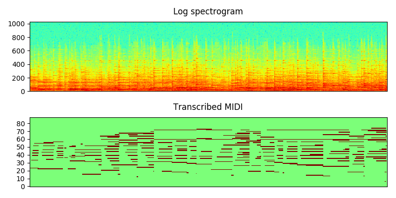

# Piano transcription

Piano transcription is the task to transcribe piano recordings to MIDI. That is, transcribe waveform to symbolic music notes. This codebase contains PyTorch implementation of 1. Inference a piano audio recording to MIDI using pretrained model; 2. Training a piano transcription system. 

This codebase is the implementation of [1]: "High resolution piano transcription by regressing onset and offset time stamps". Both of piano notes and piano pedals are transcribed. First, audio recordings are split into 10-second audio segments. Then log mel spectrogram is used as feature. The targets for training includes onset regression, offset regression, framewise classification and velocity regression. CNN + BiGRU is used to build the piano transcription system. We have used this piano transcription system to build a GiantMIDI-Piano dataset [2]. See demos here: https://www.youtube.com/watch?v=5U-WL0QvKCg

## Transcribe using pretrained model
Transcribe a piano recording is easy! First, install dependencies in requirements.txt

Then, execute the following command to transcribe an audio recording into an MIDI file.

```
MODEL_TYPE="Note_pedal"
CHECKPOINT_PATH='note_F1=0.9677_pedal_F1=0.8658.pth'
python3 pytorch/inference.py --model_type=$MODEL_TYPE --checkpoint_path=$CHECKPOINT_PATH --audio_path='resources/cut_liszt.mp3' --checkpoint_path=$CHECKPOINT_PATH --cuda
```

## Training a piano transcription system from scratch

This section provides instructions of training a piano transcription system.

### 0. Prepare data
MAESTRO dataset [1] is used for training the piano transcription system. MAESTRO consists of over 200 hours of virtuosic piano performances captured with fine alignment (~3 ms) between note labels and audio waveforms. MAESTRO dataset can be downloaded from https://magenta.tensorflow.org/datasets/maestro. This codebase used MAESTRO V2.0.0 for training.

Statistics of MAESTRO V2.0.0 [[ref]](https://magenta.tensorflow.org/datasets/maestro#v200):

| Split      | Performances | Duration (hours) | Size (GB) | Notes (millions) |
|------------|--------------|------------------|-----------|------------------|
| Train      |          967 |            161.3 |      97.7 |             5.73 |
| Validation |          137 |             19.4 |      11.8 |             0.64 |
| Test       |          178 |             20.5 |      12.4 |             0.76 |
| **Total**  |      **1282**|         **201.2**|  **121.8**|          **7.13**|

After downloading, the dataset looks like:

<pre>
dataset_root
├── 2004
│    └── (264 files)
├── 2006
│    └── (230 files)
├── 2008
│    └── (294 files)
├── 2009
│    └── (250 files) 
├── 2011
│    └── (326 files)
├── 2013
│    └── (254 files)
├── 2014
│    └── (210 files)
├── 2015
│    └── (258 files)
├── 2017
│    └── (280 files)
├── 2018
│    └── (198 files)
├── LICENSE
├── maestro-v2.0.0.csv
├── maestro-v2.0.0.json
└── README
</pre>

### 1. Train

To train the systems, modify and execute commands in runme.sh, including:
1) Config dataset path and your workspace.
2) Pack audio recordings to hdf5 files.
3) Train piano note and piano pedal transcription systems individually.
4) Combine piano note and piano pedal transcription systems.
4) Evaluate.

## Results
The training uses a single Tesla-V100-PCIE-32GB card. The system is trained for 300k iterations for one week. The training looks like:

<pre>
Namespace(augmentation='none', batch_size=12, cuda=True, early_stop=300000, filename='main', learning_rate=0.0005, loss_type='regress_onset_offset_frame_velocity_bce', max_note_shift=0, mini_data=False, mode='train', model_type='Regress_onset_offset_frame_velocity_CRNN', reduce_iteration=10000, resume_iteration=0, workspace='.../workspaces/piano_transcription')
Using GPU.
train segments: 571589
Evaluate train segments: 571589
Evaluate validation segments: 68646
Evaluate test segments: 71959
------------------------------------
Iteration: 0
    Train statistics: {'frame_ap': 0.0613, 'reg_onset_mae': 0.514, 'reg_offset_mae': 0.482, 'velocity_mae': 0.1362}
    Validation statistics: {'frame_ap': 0.0605, 'reg_onset_mae': 0.5143, 'reg_offset_mae': 0.4819, 'velocity_mae': 0.133}
    Test statistics: {'frame_ap': 0.0601, 'reg_onset_mae': 0.5139, 'reg_offset_mae': 0.4821, 'velocity_mae': 0.1283}
    Dump statistics to .../workspaces/piano_transcription/statistics/main/Regress_onset_offset_frame_velocity_CRNN/loss_type=regress_onset_offset_frame_velocity_bce/augmentation=none/batch_size=12/statistics.pkl
    Dump statistics to .../workspaces/piano_transcription/statistics/main/Regress_onset_offset_frame_velocity_CRNN/loss_type=regress_onset_offset_frame_velocity_bce/augmentation=none/batch_size=12/statistics_2020-04-28_00-22-33.pickle
Train time: 5.498 s, validate time: 92.863 s
Model saved to .../workspaces/piano_transcription/checkpoints/main/Regress_onset_offset_frame_velocity_CRNN/loss_type=regress_onset_offset_frame_velocity_bce/augmentation=none/batch_size=12/0_iterations.pth
------------------------------------
...
------------------------------------
Iteration: 300000
    Train statistics: {'frame_ap': 0.9439, 'reg_onset_mae': 0.091, 'reg_offset_mae': 0.127, 'velocity_mae': 0.0241}
    Validation statistics: {'frame_ap': 0.9245, 'reg_onset_mae': 0.0985, 'reg_offset_mae': 0.1327, 'velocity_mae': 0.0265}
    Test statistics: {'frame_ap': 0.9285, 'reg_onset_mae': 0.097, 'reg_offset_mae': 0.1353, 'velocity_mae': 0.027}
    Dump statistics to .../workspaces/piano_transcription/statistics/main/Regress_onset_offset_frame_velocity_CRNN/loss_type=regress_onset_offset_frame_velocity_bce/augmentation=none/batch_size=12/statistics.pkl
    Dump statistics to .../workspaces/piano_transcription/statistics/main/Regress_onset_offset_frame_velocity_CRNN/loss_type=regress_onset_offset_frame_velocity_bce/augmentation=none/batch_size=12/statistics_2020-04-28_00-22-33.pickle
Train time: 8953.815 s, validate time: 93.683 s
Model saved to .../workspaces/piano_transcription/checkpoints/main/Regress_onset_offset_frame_velocity_CRNN/loss_type=regress_onset_offset_frame_velocity_bce/augmentation=none/batch_size=12/300000_iterations.pth
</pre>


## Visualization of piano transcription

**Demo 1.** Andras Schiff: J.S.Bach - French Suites [[wav]](resources/cut_bach.mp3) [[transcribed_midi]](resources/cut_bach.mid)


**Demo 2.** Lang Lang: Franz Liszt - Love Dream (Liebestraum) [[wav]](resources/cut_liszt.mp3) [[transcribed_midi]](resources/cut_liszt.mid)




## Contact
Qiuqiang Kong

## Cite
[1] Qiuqiang Kong, Bochen Li, Xuchen Song, Yuxuan Wang., High resolution piano transcription by regressing onset and offset time stamps, [To appear] 2020

[2] Qiuqiang Kong, Bochen Li, Jitong Chen, Yuxuan Wang, GiantMIDI-Piano A MIDI dataset for classical piano music compositions, [To appear] 2020