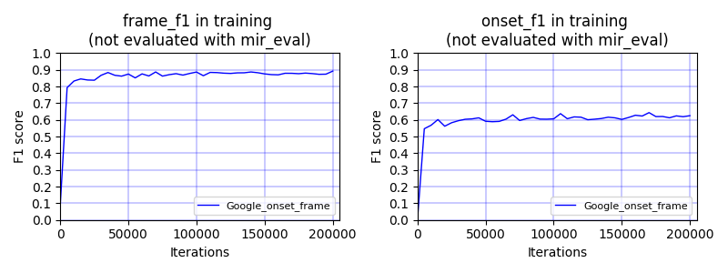

# Piano transcription

Piano transcription is the task to transcribe piano recordings to MIDI. That is, transcribe waveform to symbolic music notes. This codebase contains PyTorch implementation of 1. Inference a piano audio recording to MIDI using pretrained model; 2. Training a piano transcription system.

## Inference using pretrained model
This allows users to transcribe an audio recording using a pretrained model. First, install dependencies in requirements.txt

Then, execute the following command to inference an audio recording in wav format.

`
CHECKPOINT_PATH="/mnt/cephfs_new_wj/speechsv/kongqiuqiang/workspaces/pub_piano_transcription/pretrained_checkpoints/Google_onset_frame_200000_iterations.pth"
python3 pytorch/main_inference.py --cuda --checkpoint_path=$CHECKPOINT_PATH --audio_path='examples/cut_liszt.wav'
`

Demo: https://www.youtube.com/watch?v=easks37Q4iE

## Training a piano transcription system

This section provides instructions of training a piano transcription system.

### 0. Prepare data
MAESTRO dataset [1] is used for training the piano transcription system. MAESTRO consists of over 200 hours of virtuosic piano performances captured with fine alignment (~3 ms) between note labels and audio waveforms. MAESTRO dataset can be downloaded from https://magenta.tensorflow.org/datasets/maestro. This codebase used MAESTRO V2.0.0 for training.

Statistics of MAESTRO V2.0.0 [[ref]](https://magenta.tensorflow.org/datasets/maestro#v200):

| Split      | Performances | Duration (hours) | Size (GB) | Notes (millions) |
|------------|--------------|------------------|-----------|------------------|
| Train      |          967 |            161.3 |      97.7 |             5.73 |
| Validation |          137 |             19.4 |      11.8 |             0.64 |
| Test       |          178 |             20.5 |      12.4 |             0.76 |
| **Total**  |      **1282**|         **201.2**|  **121.8**|          **7.13**|

After downloading, the dataset looks like:

<pre>
dataset_root
├── 2004
│    └── (264 files)
├── 2006
│    └── (230 files)
├── 2008
│    └── (294 files)
├── 2009
│    └── (250 files) 
├── 2011
│    └── (326 files)
├── 2013
│    └── (254 files)
├── 2014
│    └── (210 files)
├── 2015
│    └── (258 files)
├── 2017
│    └── (280 files)
├── 2018
│    └── (198 files)
├── LICENSE
├── maestro-v2.0.0.csv
├── maestro-v2.0.0.json
└── README
</pre>

### 1. Train
The baseline system is built using "Onsets and frames: Dual-objective piano transcription." [2]. There are some difference in the implementation including:
1) GRU is used instead of LSTM. 
2) A sampling rate of 32 kHz is used instead of 16 kHz. 
3) A hop size of 10 ms is used instead of 31.25 ms. 
4) Notes are set to ON until pedal is released.
5) Cross segment notes are masked out in training.

An example of target for training can be [viewed](appendixes/target.png), its corresponding waveform can be [downloaded](appendixes/target.wav).

To train the systems, execute commands in runme.sh, which includes:
1) Config dataset path and your workspace.
2) Pack audio recordings to hdf5 files.
3) Train.
4) Evaluate.
5) Inference using trained model.

## Results
The training is carried on two Tesla-V100-PCIE-32GB cards. The training speed is around 1 second / iteration. The system is trained for 200,000 iterations in around 2 days. The statistics during training looks like:

Notice the above curve are not final metrics evaluated with mir_eval. The metrics evaluated using mir_eval is usually higher than the above curve because mir_eval has tolerance in detecting onsets and offsets.

Evaluation results using mir_eval toolbox are:

|  | Frame F1 | Note F1 | Note with offset | Note with offset & velocity |
|:----------------------:|:--------:|:-------:|:----------------:|:---------------------------:|
| Google Onset-frame [1] | 0.892 | 0.948 | 0.797 | 0.760 |
| Reproduced [1] | 0.881 | 0.940 | *0.638 | - |

The symbol * indicates this repo processed offset depends on pedal, so the evaluation metric can be different from [2].

## Visualization of piano transcription

**Demo 1.** Andras Schiff: J.S.Bach - French Suites [[wav]](examples/cut_bach.wav) [[transcribed_midi]](appendixes/cut_bach.mid)

**Demo 2.** Lang Lang: Franz Liszt - Love Dream (Liebestraum) [[wav]](examples/cut_liszt.wav) [[transcribed_midi]](appendixes/cut_liszt.mid)

## Reference
[1] Curtis Hawthorne, Andriy Stasyuk, Adam Roberts, Ian Simon, Cheng-Zhi Anna Huang, Sander Dieleman, Erich Elsen, Jesse Engel, and Douglas Eck. "Enabling Factorized Piano Music Modeling and Generation with the MAESTRO Dataset." In International Conference on Learning Representations (ICLR), 2019.

[2] Hawthorne, Curtis, Erich Elsen, Jialin Song, Adam Roberts, Ian Simon, Colin Raffel, Jesse Engel, Sageev Oore, and Douglas Eck. "Onsets and frames: Dual-objective piano transcription.", International Society for Music Information Retrieval (ISMIR), 2018.